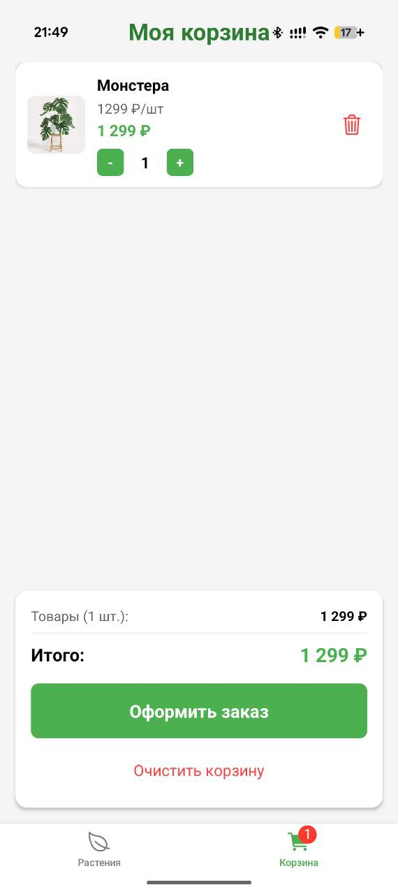
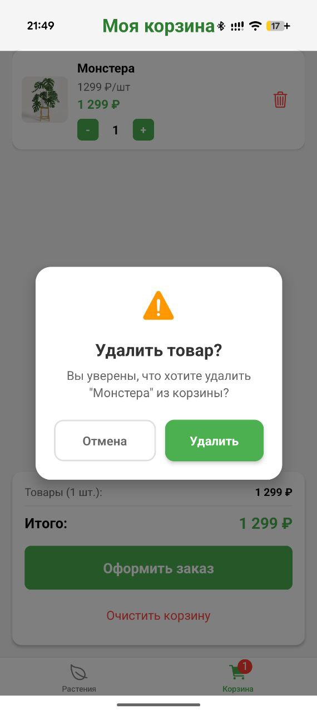

<h1 align="center" >
  🌿 Магазин растений - Plant Store
</h1>

  Разработано на <strong style="color: #61DAFB;">React Native</strong> с <strong>Expo</strong>

<strong>
🛍 Основные функции</strong>

| Каталог товаров | Карточка товара |
| :---: | :---: |
|  |  |
| **Просмотр ассортимента** | **Детали растения** |

| Добавление в корзину | Управление корзиной |
| :---: | :---: |
|  |  |
| **Выбор товаров** | **Корзина покупок** |

### 📋 Процесс заказа

| Подтверждение заказа | Успешный заказ |
| :---: | :---: |
|  |  |
| **Оформление заказа** | **Заказ принят!** |

| Удаление товара |
| :---: |
|  |
| **Управление корзиной** |

